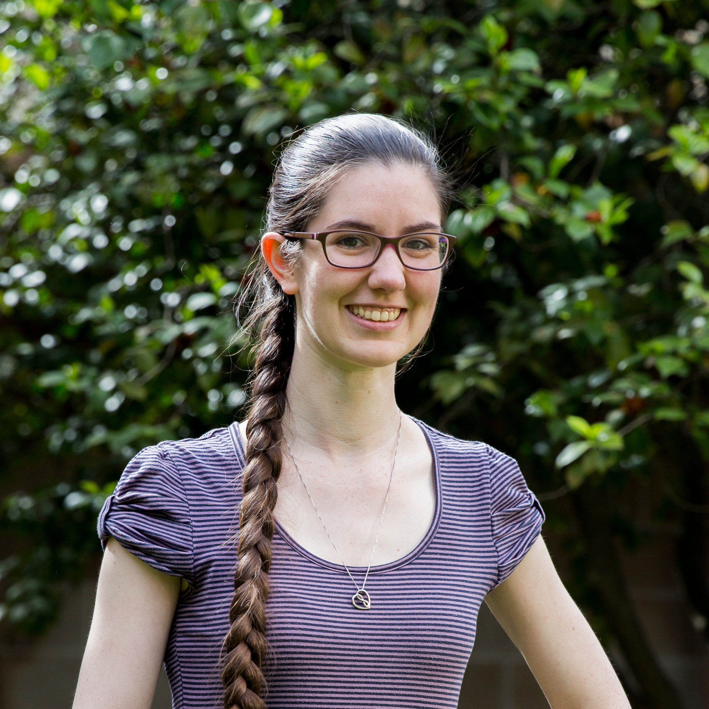

# Welcome

Hi, I'm Meirian.

I am a teacher, consultant and senior community co-ordinator at the University of Melbourne. I offer training in Ubuntu and LaTeX at Research Computing Services. My other areas of interest include data analysis, operations research and statistics, which I also have the pleasure of teaching at the University. I love teaching and am enthusiastic about enabling others to benefit from the skills that I teach! 

Get in touch with me for more information about Ubuntu training, events, and community support:



Follow or tweet at me on [@MeirianLT](www.twitter.com/MeirianLT) and [@ResCom\_unimelb](https://twitter.com/ResCom_unimelb).



Check out some of our videos and subscribe to the [ResCom Team](https://www.youtube.com/channel/UCGWU-ESE1j2vCJTACZHHLGQ)!



Check out our photos and gifs on the [ResCom\_unimelb Instagram](https://www.instagram.com/rescom_unimelb).



Email me at: mlovelace\(at\)unimelb.edu.au  
\(Replace the "\(at\)" with the "@" symbol\).



I look forward to meeting you at our next training!

